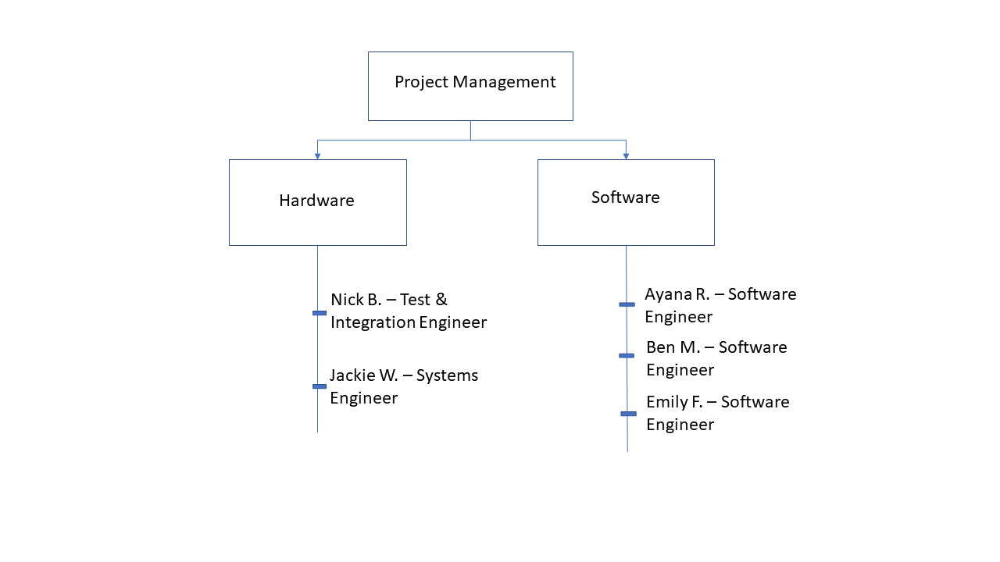

# Team Responsibilities
### Project Manager:
Manages the development, implementation, and evaluation of complex designs. 
Oversees product construction and testing to ensure completion of the project as efficiently and effectively as possible 
Evaluates and approves changes that impact scope, budget, or schedule. 
### Communications Manager:
Make sure the team is communicating effectively/efficiently.
Communicate with external advisors/stakeholders and schedule meetings.
### Logistics Manager:
Responsible for planning, coordinating, and monitoring inventory, transportation, and supply processes. 
### Design Manager:
Manage design tools, methods, and activities. 
Oversee development and assembly. 
Determine cost issues, producibility, quality, performance, reliability, serviceability, and intended lifespan.
### Test Manager:
Manage the evaluation, recommendation and implementation of testing procedures and strategies for the project’s systems, components, and/or modifications. 
